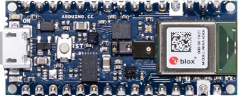
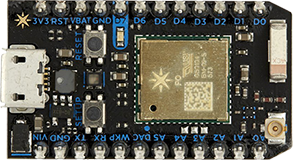
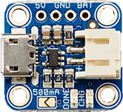
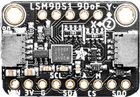
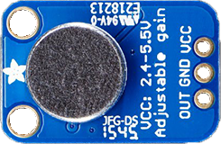

# Kloala 

## Quick Overview

[SimpleShow Video](https://videos.mysimpleshow.com/6URJ26FOZ4)

## Hardware

### Boards

|[Arduino Nano 33 BLE Sense](https://store.arduino.cc/arduino-nano-33-ble-sense)|[Particle Photon Board](https://store.particle.io/products/photon)|
|:-:|:-:|
|||

|[Adafruit Micro-Lipo Charger](https://www.adafruit.com/product/1904)|[Adafruit 9-DOF LSM9DS1 Breakout](https://www.adafruit.com/product/4634)|[Adafruit Electret Microphone Amp - MAX4466](https://www.adafruit.com/product/1063)|
|:-:|:-:|:-:|
||||

### Sensors
#### on the Arduino

|Type|Name|Quick Info|Datasheet|
|:-:|:-:|:-:|:-:|
|Temperature, Humidity|HTS221|±3.5% Humidity accuracy, ±0.5% Temp accuracy, 16-bit resolution|https://content.arduino.cc/assets/Nano_BLE_Sense_HTS221.pdf|
|Temperature, Humidity|DHT 11|crap|https://cdn-learn.adafruit.com/downloads/pdf/dht.pdf|
|Gesture, light, proximity|APDS9960||https://content.arduino.cc/assets/Nano_BLE_Sense_av02-4191en_ds_apds-9960.pdf|
|Barometric pressure|LPS22HB||https://content.arduino.cc/assets/Nano_BLE_Sense_lps22hb.pdf|

#### 3rd party

|Type|Name|Quick Info|Datasheet|
|:-:|:-:|:-:|:-:|
|Proximity, range|VL6180X|Range: 0..130mm, Pretty high accuracy (±3%) with any surface between 10mm..130mm|https://www.st.com/resource/en/datasheet/vl6180x.pdf|

## Getting started

* Particle Photon
  * [Quick start](https://docs.particle.io/quickstart/photon/)
  * [Examples](https://docs.particle.io/tutorials/hardware-projects/hardware-examples/photon/)

## Documentation

* PlatformIO
  * [Arduino Nano 33 BLE](https://docs.platformio.org/en/latest/boards/nordicnrf52/nano33ble.html?utm_medium=piohome&utm_source=platformio)
* [Particle](https://docs.particle.io/)
  * [Particle Cloud API](https://docs.particle.io/reference/device-cloud/api/)
  * [Developer tools](https://www.particle.io/developer-tools/)
  * [Web IDE](https://docs.particle.io/tutorials/developer-tools/build/)